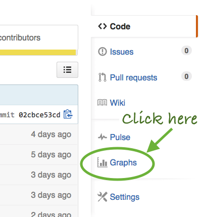
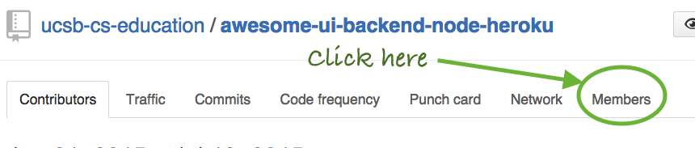
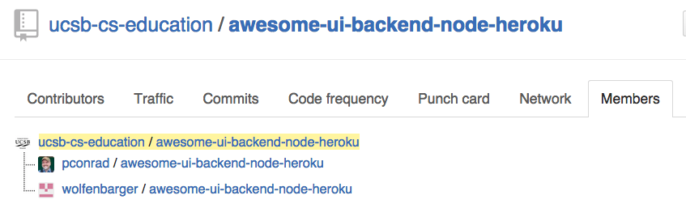

GithubWorkflow.md

The main repo with the official current code is https://github.com/ucsb-cs-education/awesome-ui-backend-node-heroku

Developers should make changes only in forks of this repo, e.g.

* https://github.com/pconrad/awesome-ui-backend-node-heroku
* https://github.com/wolfenbarger/awesome-ui-backend-node-heroku

# Adding a remote for the main repo

To add a remote for the main repo with the name ucsb-cs-education, type this command while in a clone of your forked repo.

```
git remote add ucsb-cs-education git@github.com:ucsb-cs-education/awesome-ui-backend-node-heroku.git
```

This allows you to update your fork with updates made by other programmers by doing: `git pull ucsb-cs-education master`

If this results in merge conflicts (because you've made changes that conflict with ones made by other programmers) the files with merge conflicts will be noted when you type git status.  Edit each of those files to resolve the merge conflict, then commit them again.

# Finding all forks of the main repo

You can find a list of all forks by navigating to the main repo, i.e. [ucsb-cs-education/awesome-ui-backend-node-heroku](https://github.com/ucsb-cs-education/awesome-ui-backend-node-heroku) and clicking on "graphs", then "network":







